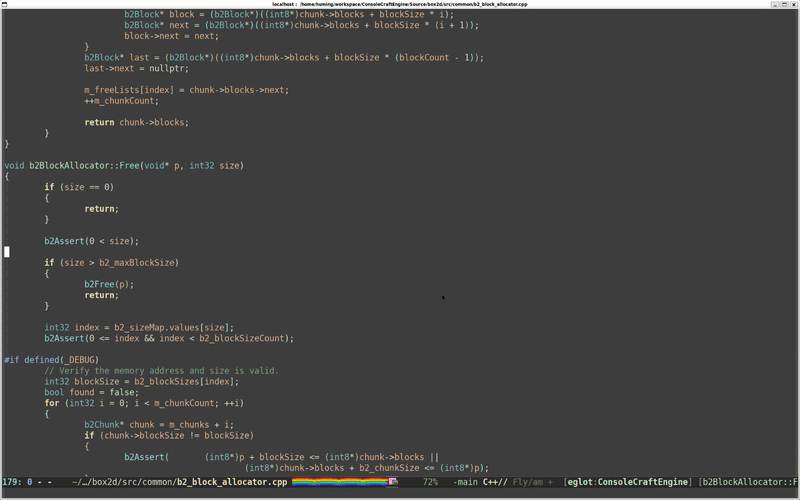

# gptel-cpp-complete

[](https://melpa.org/#/gptel-cpp-complete)
[]

`gptel-cpp-complete` is an experimental package that provides
**Copilot-style, context-aware C++ code completion** using:

- **eglot + clangd** for authoritative semantic information
- **ag (the_silver_searcher)** for repository-wide pattern retrieval
- **gptel** for LLM-powered code continuation
- **inline ghost text overlays** for a VS Code–like UX

Unlike generic AI assistants, this package is designed to behave like a
**language-server–style completion engine**, not a chat bot.
Its sole purpose is **accurate, minimal, inline code continuation**.

---

## Features

- Context-aware C++ code completion inside functions
- Uses *real* in-scope symbols from `clangd` (via `eglot`)
- Retrieves similar usage patterns from your repository with `ag`
- Uses *real* call-hierarchy data from `clangd` (via `eglot`)
- Strict system prompt to avoid hallucinated APIs
- Inline “ghost text” suggestions
- Regenerates completion as you type (except when accepting with RET)
- Support both local and remote LLM with `gptel`

---

## Requirements

- Emacs 30+
- [`eglot`](https://elpa.gnu.org/packages/eglot.html)
- [`gptel`](https://github.com/karthink/gptel)
- [`ag`](https://github.com/ggreer/the_silver_searcher)
- `clangd` with background indexing enabled

Recommended `clangd` invocation:

```bash
clangd --background-index --clang-tidy
```

Recommended `eglot` configuration:
```emacs lisp
(add-to-list 'eglot-server-programs
                 '((c-mode c-ts-mode c++-mode c++-ts-mode objc-mode)
                   . ("clangd"
                      "--compile-commands-dir=./build/"
                      "--background-index"
                      "--clang-tidy"
                      "--completion-style=detailed"
                      "--header-insertion=never"
                      "--pch-storage=memory"
                      "--malloc-trim")))
```

---

## Installation

Clone the repository and add it to your load path:

```emacs lisp
(add-to-list 'load-path "/path/to/gptel-cpp-complete")
(require 'gptel-cpp-complete)
(when (display-graphic-p)
  ;; gptel-cpp-complete-mode not work well in terminal mode
  (dolist (c-mode-hook '(c-mode-common-hook c-ts-mode-hook c++-ts-mode-hook))
    (add-hook c-mode-hook #'gptel-cpp-complete-mode)))
```

---

## Screenshots



---

## Contributing
Yes, please do! See [CONTRIBUTING](CONTRIBUTING.md) for guidelines.

---

## License

See [LICENSE](LICENSE). Copyright (c) 2025 Huming Chen <chenhuming@gmail.com>
